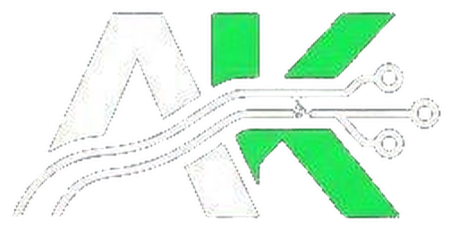
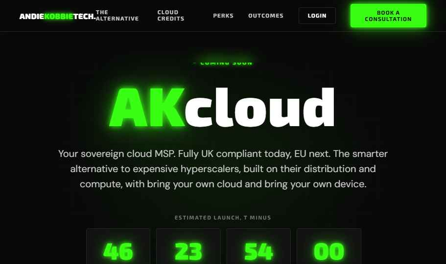
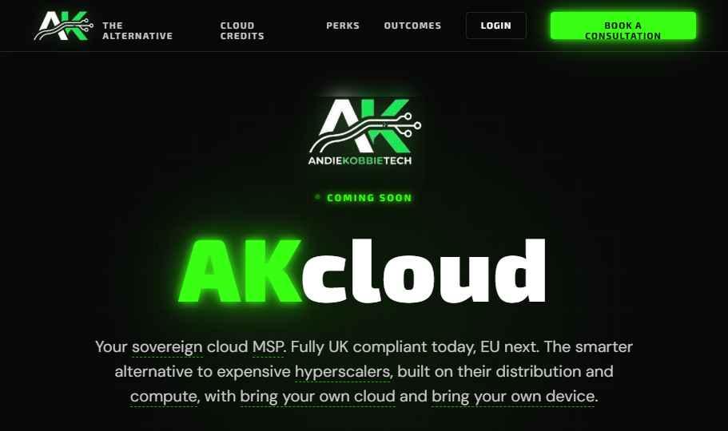

<p align="center">
  
</p>

<h1 align="center">AKcloud</h1>

<p align="center">
  <strong>Sovereign Cloud MSP — Landing Site & Client Acquisition Pipeline</strong><br>
  <em>Built end-to-end: from first wireframe to deployed production with real integrations</em>
</p>

<p align="center">
  <a href="#what-i-built">What I Built</a> •
  <a href="#live-demo">Live Demo</a> •
  <a href="#screenshots">Screenshots</a> •
  <a href="#technical-approach">Technical Approach</a> •
  <a href="#architecture">Architecture</a>
</p>

---

## What I Built

A complete client acquisition pipeline for a sovereign cloud MSP — zero frameworks, zero build steps, full data sovereignty.

| Feature | Implementation |
|---|---|
| **Animated Landing Page** | Custom CSS animations — phosphorescent circuit board aesthetic, AK zoom-in intro, typewriter effects |
| **Interactive Glossary** | Hover/tap tooltips explaining cloud terminology (MSP, sovereign, hyperscaler, etc.) — accessibility-first |
| **Email Waitlist** | Netlify Forms with webhook processing → Resend email notifications → Slack/Discord alerts |
| **Appointment Booking** | Odoo XML-RPC serverless proxy ready — opens Odoo booking page when configured |
| **Admin Panel** | Live waitlist data, Odoo configuration, booking management, CSV export |
| **Security Hardened** | HSTS, CSP headers, noindex admin routes, environment-based secrets |

---

## Live Demo

**🔗 [akcloud.netlify.app](https://akcloud.netlify.app)**

---

## Screenshots

### Landing Page — Hero View
<p align="center">
  
</p>

*Full landing page with nav, countdown timer, and "Coming Soon" badge. Pure HTML/CSS — no JavaScript frameworks.*

### Interactive Glossary Tooltips
<p align="center">
  
</p>

*Hover any underlined term to see a plain-English explanation. Built for non-technical founders evaluating cloud services. Accessibility: works on touch devices, respects `prefers-reduced-motion`.*

---

## The Problem It Solves

A sovereign cloud MSP needed a professional landing page that:

1. **Captures leads** without depending on third-party form services
2. **Books discovery consultations** directly into their Odoo CRM
3. **Keeps client data sovereign** — not trapped in SaaS platforms
4. **Works without JavaScript frameworks** or build pipelines

**Result:** Zero-dependency stack that deploys in 30 seconds, handles real bookings, and maintains full data sovereignty.

---

## Technical Approach

| Layer | Stack |
|---|---|
| Frontend | Vanilla HTML/CSS/JS — no build step, no frameworks |
| Hosting | Netlify (static + serverless) |
| Forms | Netlify Forms with webhook processing |
| Backend | Netlify Functions (Node.js) |
| Booking | Odoo XML-RPC integration |
| Email | Resend API via serverless functions |
| Auth | Environment variables, Basic auth, OAuth2 for Odoo |

---

## Architecture

```
┌─────────────────┐     ┌──────────────────┐     ┌─────────────────┐
│   Landing Page  │────▶│  Netlify Forms   │────▶│  Email Notify   │
│   (Static HTML) │     │  (Lead Capture)  │     │  (Resend API)   │
└─────────────────┘     └──────────────────┘     └─────────────────┘
         │
         ▼
┌─────────────────┐     ┌──────────────────┐     ┌─────────────────┐
│  Booking Widget │────▶│ Serverless Func  │────▶│  Odoo Backend   │
│  (Vanilla JS)   │     │  (XML-RPC Proxy) │     │  (CRM + Calendar)│
└─────────────────┘     └──────────────────┘     └─────────────────┘
```

---

## What This Demonstrates

- **End-to-end ownership**: From first wireframe to deployed production site with real integrations
- **No-code to code bridge**: Started with drag-and-drop, identified limits, built custom solution
- **Problem-solving**: Client needed sovereign data control — built Odoo integration that keeps data in their infrastructure
- **B2B delivery mindset**: Every decision optimized for client trust (security headers, transparent booking flow)
- **Automation**: Email notifications, waitlist management, booking confirmation — all automated via serverless functions

---

## Running Locally

```powershell
npm install -g netlify-cli
netlify dev
# Opens at http://localhost:8888
```

---

## Skills Used

`n8n` · `Make` · `Power Automate` · `XML-RPC` · `Serverless Architecture` · `API Integration` · `Vanilla JavaScript` · `CSS Animations` · `Security Hardening` · `DevOps` · `Client-Facing Delivery`

---

<p align="center">
  <strong>Built by Andie Kobbie</strong><br>
  <em>AI Solutions Consultant / Automation Engineer</em><br>
  <a href="https://github.com/andiekobbietks">GitHub</a>
</p>
